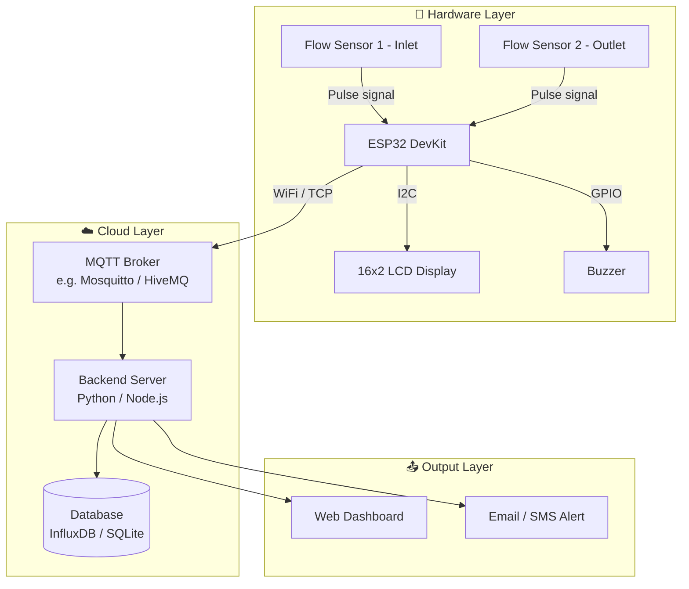

# 💧 Water Pipe Leakage Detection System

> An IoT-based water pipe leakage detection system using **ESP32** and **water flow sensors**.  
> The system monitors real-time water flow, detects anomalies indicating leaks, and sends instant alerts via MQTT.


---

## 📋 Table of Contents

- [Features](#-features)
- [Hardware Required](#-hardware-required)
- [System Architecture](#-system-architecture)
- [Circuit Wiring](#-circuit-wiring)
- [Software Setup](#-software-setup)
- [How It Works](#-how-it-works)
- [Project Structure](#-project-structure)
- [Contributing](#-contributing)
- [License](#-license)

---

## ✨ Features

- 📊 Real-time flow rate monitoring using YF-S201 water flow sensors
- 🔍 Leak detection algorithm based on inlet vs outlet flow differential
- 📟 Live readings displayed on **16x2 LCD (I2C)**
- 📶 WiFi connectivity via ESP32 for cloud data publishing
- 📡 MQTT-based communication with a central monitoring dashboard
- 🔔 Buzzer alert for immediate local notification on leak detection
- 🌐 Web dashboard with flow rate charts and alert history
- 💾 Historical data logging for trend analysis

---

## 🔧 Hardware Required

| Component | Specification | Quantity |
|---|---|---|
| ESP32 DevKit | ESP32-WROOM-32 | 1 |
| Water Flow Sensor | YF-S201 (1–30 L/min) | 2 (inlet & outlet) |
| LCD Display | 16x2 with I2C module (PCF8574) | 1 |
| Buzzer | Active buzzer, 5V | 1 |
| Jumper wires | Male-to-male & male-to-female | — |
| Breadboard | 830 tie-point | 1 |
| Power Supply | 5V / 2A USB or adapter | 1 |

---

## 🏗️ System Architecture



---

## 🔌 Circuit Wiring

### Water Flow Sensors (YF-S201)

| YF-S201 Wire | ESP32 Pin |
|---|---|
| Red (VCC) | 5V (VIN) |
| Black (GND) | GND |
| Yellow (Signal) — Sensor 1 | GPIO 18 |
| Yellow (Signal) — Sensor 2 | GPIO 19 |

### 16x2 LCD (I2C Module)

| LCD I2C Pin | ESP32 Pin |
|---|---|
| VCC | 3.3V or 5V |
| GND | GND |
| SDA | GPIO 21 |
| SCL | GPIO 22 |

### Buzzer

| Buzzer Pin | ESP32 Pin |
|---|---|
| Positive (+) | GPIO 23 |
| Negative (–) | GND |

---

## 💻 Software Setup

### 1. Clone the repository

```bash
git clone https://github.com/adhilmm18/water-pipe-leakage-detection.git
cd water-pipe-leakage-detection
```

### 2. Install required Arduino libraries

Open Arduino IDE → **Library Manager** and install:

- `LiquidCrystal_I2C` by Frank de Brabander
- `PubSubClient` by Nick O'Leary
- `WiFi` (built-in with ESP32 board package)

### 3. Configure credentials

Open `firmware/config.h` and update:

```cpp
#define WIFI_SSID       "your_wifi_name"
#define WIFI_PASSWORD   "your_wifi_password"
#define MQTT_BROKER     "broker.hivemq.com"
#define MQTT_PORT       1883
#define LEAK_THRESHOLD  2.0   // L/min difference to trigger alert
```

### 4. Flash the ESP32

- Open `firmware/src/main.cpp` in Arduino IDE
- Select board: **ESP32 Dev Module**
- Select the correct COM port
- Click **Upload**

### 5. Run the backend server

```bash
cd backend
pip install -r requirements.txt
python server.py
```

### 6. Open the dashboard

Open `dashboard/index.html` in your browser or deploy to a local server.

---

## ⚙️ How It Works

1. **Two flow sensors** are placed at the inlet and outlet of the pipe segment being monitored.
2. Each sensor generates **pulse signals** proportional to the flow rate — the ESP32 counts these pulses using interrupts.
3. The ESP32 calculates the **flow rate (L/min)** for both sensors every second.
4. If the **difference between inlet and outlet flow** exceeds a configurable threshold (default: 2 L/min), a **leak is detected**.
5. On leak detection:
   - The **LCD displays** a "LEAK DETECTED!" warning with the flow values
   - The **buzzer sounds** an alert
   - An MQTT message is **published to the broker**
   - The backend server **logs the event** and sends notifications
6. Real-time data is continuously streamed to the **web dashboard**.

---

## 📁 Project Structure

```
water-pipe-leakage-detection/
├── README.md
├── LICENSE
├── .gitignore
├── firmware/
│   ├── src/
│   │   ├── main.cpp               # Main ESP32 code
│   │   ├── flow_sensor.cpp/.h     # Flow sensor logic
│   │   ├── lcd_display.cpp/.h     # 16x2 LCD display functions
│   │   ├── wifi_mqtt.cpp/.h       # WiFi & MQTT communication
│   │   └── leakage_detection.cpp/.h  # Leak detection algorithm
│   ├── config.h                   # WiFi, MQTT, threshold settings
│   └── platformio.ini             # PlatformIO config (optional)
├── hardware/
│   ├── wiring_diagram.png         # Circuit wiring diagram
│   ├── schematic.pdf              # Full circuit schematic
│   └── components_list.md         # Bill of materials
├── backend/
│   ├── server.py                  # Flask/FastAPI server
│   ├── mqtt_subscriber.py         # MQTT data listener
│   ├── requirements.txt           # Python dependencies
│   └── docker-compose.yml         # Optional Docker setup
├── dashboard/
│   ├── index.html                 # Web monitoring dashboard
│   └── app.js                     # Dashboard JavaScript
├── docs/
│   ├── system_architecture.md
│   ├── how_it_works.md
│   └── setup_guide.md
└── tests/
    ├── test_flow_sensor.py
    └── test_leak_detection.py
```


## 📄 License

This project is licensed under the **MIT License** — see the [LICENSE](LICENSE) file for details.

---

## 👤 Author

**Adhil MM**  
GitHub: [@adhilmm18](https://github.com/adhilmm18)

---

> ⭐ If you find this project useful, please give it a star on GitHub!
