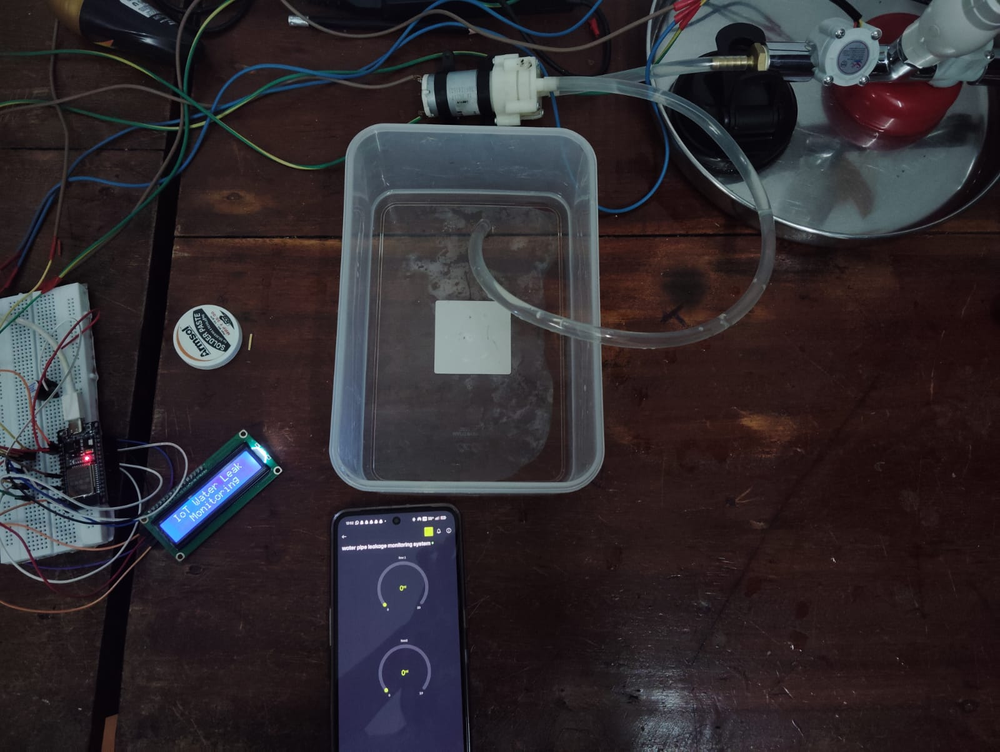
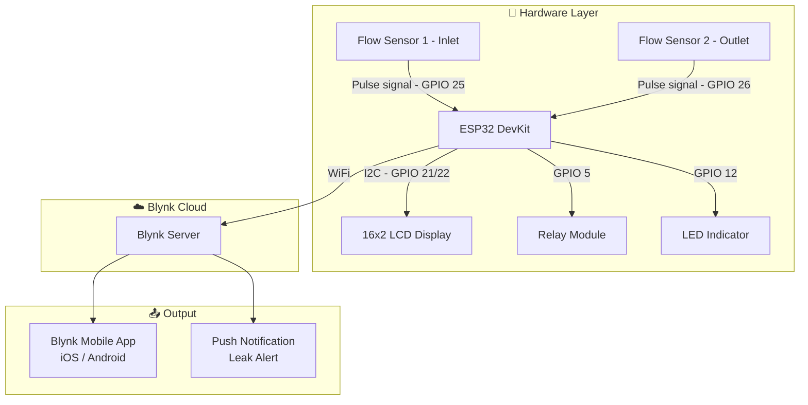
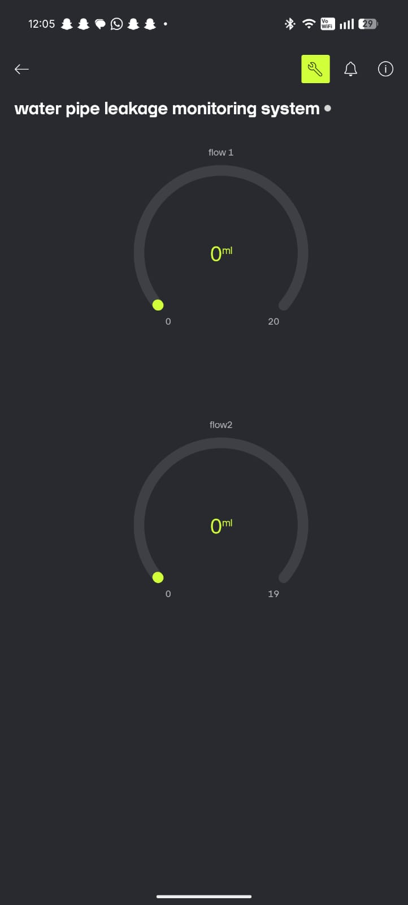

# 💧 Water Pipe Leakage Detection System

> An IoT-based water pipe leakage detection system using **ESP32**, **water flow sensors**, and **Blynk IoT**.  
> The system monitors real-time water flow, detects anomalies indicating leaks, and sends instant alerts via the Blynk app.


---



---

## 🎬 Demo

[](https://youtu.be/V3AjE1x1s3U)
> ▶️ Click the image above to watch the full demo on YouTube

---

## 📋 Table of Contents

- [Features](#-features)
- [Hardware Required](#-hardware-required)
- [System Architecture](#-system-architecture)
- [Circuit Wiring](#-circuit-wiring)
- [Blynk Setup](#-blynk-setup)
- [Arduino IDE Setup](#-arduino-ide-setup)
- [How It Works](#-how-it-works)
- [Project Structure](#-project-structure)
- [Contributing](#-contributing)
- [License](#-license)

---

## ✨ Features

- 📊 Real-time flow rate monitoring using YF-S201 water flow sensors
- 🔍 Leak detection based on inlet vs outlet flow rate differential
- 📟 Live flow readings displayed on **16x2 LCD (I2C)**
- 🔔 Buzzer alert for immediate local notification on leak detection
- 📱 **Blynk app** dashboard for remote real-time monitoring
- 🚨 **Blynk push notifications** sent to your phone on leak detection
- 🔁 **Manual override** to control the motor relay via Blynk app
- 📶 WiFi connectivity via ESP32

---

## 🔧 Hardware Required

| Component | Specification | Quantity |
|---|---|---|
| ESP32 DevKit | ESP32-WROOM-32 | 1 |
| Water Flow Sensor | YF-S201 (1–30 L/min) | 2 (inlet & outlet) |
| LCD Display | 16x2 with I2C module (PCF8574) | 1 |
| Relay Module | 5V single channel | 1 |
| LED Indicator | 5mm LED | 1 |
| Jumper wires | Male-to-male & male-to-female | — |
| Breadboard | 830 tie-point | 1 |
| Power Supply | 5V / 2A USB or adapter | 1 |

---

## 🏗️ System Architecture



---

## 🔌 Circuit Wiring

### Water Flow Sensors (YF-S201)

| YF-S201 Wire | Color | ESP32 Pin |
|---|---|---|
| VCC | Red | VIN (5V) |
| GND | Black | GND |
| Signal — Sensor 1 (Inlet) | Yellow | GPIO 25 |
| Signal — Sensor 2 (Outlet) | Yellow | GPIO 26 |

### 16x2 LCD Display (I2C Module)

| LCD I2C Pin | ESP32 Pin |
|---|---|
| VCC | 5V (VIN) |
| GND | GND |
| SDA | GPIO 21 |
| SCL | GPIO 22 |

### Relay Module & LED

| Component | Pin | ESP32 Pin |
|---|---|---|
| Relay | Signal | GPIO 5 |
| Relay | VCC | 5V |
| Relay | GND | GND |
| LED | Positive (+) | GPIO 12 |
| LED | Negative (–) | GND |

---

## 📱 Blynk Setup

### 1. Create a Blynk account
- Download the **Blynk IoT** app on [Android](https://play.google.com/store/apps/details?id=cloud.blynk) or [iOS](https://apps.apple.com/app/blynk-iot/id1559317868)
- Sign up at [blynk.cloud](https://blynk.cloud)

### 2. Create a new Template
- Go to **Blynk Console** → **Templates** → **New Template**
- Name: `water pipe leakage monitoring system`
- Hardware: `ESP32`
- Connection: `WiFi`

### 3. Add Datastreams (Virtual Pins)

| Virtual Pin | Name | Data Type | Purpose |
|---|---|---|---|
| V0 | Flow 1 | Double | Inlet flow rate (mL/s) |
| V1 | Flow 2 | Double | Outlet flow rate (mL/s) |
| V2 | Motor Control | Integer | 1 = ON, 0 = OFF (manual) |
| V3 | Mode Toggle | Integer | 1 = Manual, 0 = Auto |

### 4. Set up the Dashboard (Web & App)
Add these widgets in the Blynk app:
- **Gauge** → V0 — Flow 1 (Inlet)
- **Gauge** → V1 — Flow 2 (Outlet)
- **Button (Switch)** → V2 — Motor ON/OFF (manual control)
- **Button (Switch)** → V3 — Manual / Auto mode toggle
- **Event** → `flow_notify` — for leak push notifications

### Dashboard Preview



### 5. Get your credentials
In Blynk Console → your Template → copy:
- `BLYNK_TEMPLATE_ID`
- `BLYNK_TEMPLATE_NAME`
- `BLYNK_AUTH_TOKEN`

Paste these into `firmware/main/config.h`.

---

## 🖥️ Arduino IDE Setup

### 1. Install ESP32 board in Arduino IDE

Go to **File → Preferences** and add this URL to Additional Board Manager URLs:
```
https://raw.githubusercontent.com/espressif/arduino-esp32/gh-pages/package_esp32_index.json
```
Then go to **Tools → Board → Board Manager**, search `esp32`, and install.

### 2. Install required libraries

Go to **Sketch → Include Library → Manage Libraries** and install:

| Library | Author |
|---|---|
| `Blynk` | Volodymyr Shymanskyy |
| `LiquidCrystal_I2C` | Frank de Brabander |

### 3. Configure your credentials

Copy `firmware/main/config.example.h` → rename to `config.h` and fill in:

```cpp
// Blynk credentials
#define BLYNK_TEMPLATE_ID    "your_template_id"
#define BLYNK_TEMPLATE_NAME  "water pipe leakage monitoring system"
#define BLYNK_AUTH_TOKEN     "your_auth_token"

// WiFi credentials
#define WIFI_SSID     "your_wifi_name"
#define WIFI_PASSWORD "your_wifi_password"
```

> ⚠️ `config.h` is listed in `.gitignore` and will never be committed. Never share your auth token publicly.

### 4. Flash the ESP32

- Open `firmware/main/main.ino` in Arduino IDE
- Go to **Tools → Board** → select **ESP32 Dev Module**
- Go to **Tools → Port** → select your COM port
- Click **Upload** (→)
- Open **Serial Monitor** at `115200 baud` to see debug output

---

## ⚙️ How It Works

1. Two **YF-S201 flow sensors** are installed at the **inlet** (GPIO 25) and **outlet** (GPIO 26) of the monitored pipe section.
2. Each sensor generates pulse signals — the ESP32 counts pulses using **hardware interrupts** to calculate **flow rate in mL/s**.
3. Every second, the ESP32 compares inlet and outlet flow rates.
4. If **Flow 2 < Flow 1 and Flow 2 < 8 mL/s**, a **leak is detected**:
   - 📟 LCD shows `Leakage Detected` with `F1 > F2`
   - 💡 LED turns ON
   - 🔁 Relay activates (motor shutoff)
   - 📱 Blynk virtual pins V0 and V1 update in real time
   - 🚨 Blynk **event** `flow_notify` fires a push notification
5. **Manual Override (V3):** Switch the system to manual mode via the Blynk app. In manual mode, the relay and LED are controlled directly by the V2 button — auto leak detection is paused.
6. When switched back to auto, the relay resets and normal monitoring resumes.

---

## 📁 Project Structure

```
water-pipe-leakage-detection/
├── README.md
├── LICENSE
├── .gitignore
├── assets/
│   ├── hardware_setup.jpeg     # Hardware photo
│   └── app_screenshot.jpeg     # Blynk app screenshot
└── firmware/
    └── main/
        ├── main.ino            # Main Arduino sketch
        ├── config.h            # Your credentials (gitignored)
        └── config.example.h    # Template — safe to commit
```

---

## 🤝 Contributing

Contributions are welcome! To contribute:

1. Fork the repository
2. Create a feature branch: `git checkout -b feature/your-feature-name`
3. Commit your changes: `git commit -m "Add your feature"`
4. Push to the branch: `git push origin feature/your-feature-name`
5. Open a Pull Request

Please open an **issue** first to discuss major changes.

---

## 📄 License

This project is licensed under the **MIT License** — see the [LICENSE](LICENSE) file for details.

---

## 👤 Author

**Adhil MM**  
GitHub: [@adhilmm18](https://github.com/adhilmm18)

---

> ⭐ If you find this project useful, please give it a star on GitHub!
