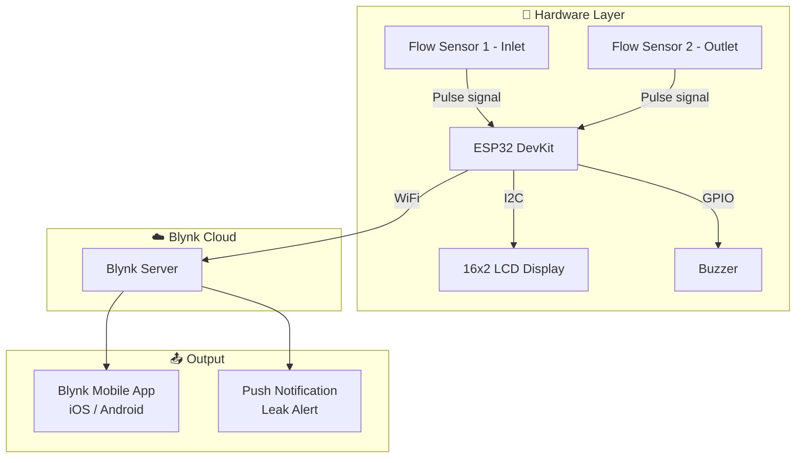

# 💧 Water Pipe Leakage Detection System

> An IoT-based water pipe leakage detection system using **ESP32**, **water flow sensors**, and **Blynk IoT**.  
> The system monitors real-time water flow, detects anomalies indicating leaks, and sends instant alerts via the Blynk app.


---

## 📋 Table of Contents

- [Features](#-features)
- [Hardware Required](#-hardware-required)
- [System Architecture](#-system-architecture)
- [Circuit Wiring](#-circuit-wiring)
- [Blynk Setup](#-blynk-setup)
- [Arduino IDE Setup](#-arduino-ide-setup)
- [How It Works](#-how-it-works)
- [Project Structure](#-project-structure)
- [Contributing](#-contributing)
- [License](#-license)

---

## ✨ Features

- 📊 Real-time flow rate monitoring using YF-S201 water flow sensors
- 🔍 Leak detection based on inlet vs outlet flow rate differential
- 📟 Live flow readings displayed on **16x2 LCD (I2C)**
- 🔔 Buzzer alert for immediate local notification on leak detection
- 📱 **Blynk app** dashboard for remote real-time monitoring
- 🚨 **Blynk push notifications** sent to your phone on leak detection
- 📶 WiFi connectivity via ESP32

---

## 🔧 Hardware Required

| Component | Specification | Quantity |
|---|---|---|
| ESP32 DevKit | ESP32-WROOM-32 | 1 |
| Water Flow Sensor | YF-S201 (1–30 L/min) | 2 (inlet & outlet) |
| LCD Display | 16x2 with I2C module (PCF8574) | 1 |
| Buzzer | Active buzzer, 5V | 1 |
| Jumper wires | Male-to-male & male-to-female | — |
| Breadboard | 830 tie-point | 1 |
| Power Supply | 5V / 2A USB or adapter | 1 |

---

## 🏗️ System Architecture



---

## 🔌 Circuit Wiring

### Water Flow Sensors (YF-S201)

| YF-S201 Wire | Color | ESP32 Pin |
|---|---|---|
| VCC | Red | VIN (5V) |
| GND | Black | GND |
| Signal — Sensor 1 (Inlet) | Yellow | GPIO 18 |
| Signal — Sensor 2 (Outlet) | Yellow | GPIO 19 |

### 16x2 LCD Display (I2C Module)

| LCD I2C Pin | ESP32 Pin |
|---|---|
| VCC | 5V (VIN) |
| GND | GND |
| SDA | GPIO 21 |
| SCL | GPIO 22 |

### Buzzer

| Buzzer Pin | ESP32 Pin |
|---|---|
| Positive (+) | GPIO 23 |
| Negative (–) | GND |

---

## 📱 Blynk Setup

### 1. Create a Blynk account
- Download the **Blynk IoT** app on [Android](https://play.google.com/store/apps/details?id=cloud.blynk) or [iOS](https://apps.apple.com/app/blynk-iot/id1559317868)
- Sign up at [blynk.cloud](https://blynk.cloud)

### 2. Create a new Template
- Go to **Blynk Console** → **Templates** → **New Template**
- Name: `Water Leakage Detector`
- Hardware: `ESP32`
- Connection: `WiFi`

### 3. Add Datastreams (Virtual Pins)

| Virtual Pin | Name | Data Type | Purpose |
|---|---|---|---|
| V0 | Inlet Flow Rate | Double | Flow rate of inlet sensor (L/min) |
| V1 | Outlet Flow Rate | Double | Flow rate of outlet sensor (L/min) |
| V2 | Leak Status | Integer | 0 = Normal, 1 = Leak Detected |

### 4. Set up the Dashboard (Web & App)
Add these widgets in the Blynk app:
- **Gauge** → V0 — Inlet Flow Rate
- **Gauge** → V1 — Outlet Flow Rate
- **LED / Indicator** → V2 — Leak Status
- **Notification** widget — for push alerts

### 5. Get your credentials
In Blynk Console → your Template → copy:
- `BLYNK_TEMPLATE_ID`
- `BLYNK_TEMPLATE_NAME`
- `BLYNK_AUTH_TOKEN`

Paste these into `firmware/config.h`.

---

## 🖥️ Arduino IDE Setup

### 1. Install ESP32 board in Arduino IDE

Go to **File → Preferences** and add this URL to Additional Board Manager URLs:
```
https://raw.githubusercontent.com/espressif/arduino-esp32/gh-pages/package_esp32_index.json
```
Then go to **Tools → Board → Board Manager**, search `esp32`, and install.

### 2. Install required libraries

Go to **Sketch → Include Library → Manage Libraries** and install:

| Library | Author |
|---|---|
| `Blynk` | Volodymyr Shymanskyy |
| `LiquidCrystal_I2C` | Frank de Brabander |

### 3. Configure your credentials

Open `firmware/config.h` and fill in:

```cpp
// Blynk credentials
#define BLYNK_TEMPLATE_ID   "your_template_id"
#define BLYNK_TEMPLATE_NAME "Water Leakage Detector"
#define BLYNK_AUTH_TOKEN    "your_auth_token"

// WiFi credentials
#define WIFI_SSID           "your_wifi_name"
#define WIFI_PASSWORD       "your_wifi_password"

// GPIO Pins
#define FLOW_SENSOR_1_PIN   18   // Inlet
#define FLOW_SENSOR_2_PIN   19   // Outlet
#define BUZZER_PIN          23

// Leak detection threshold
#define LEAK_THRESHOLD      2.0  // L/min difference to trigger alert
```

### 4. Flash the ESP32

- Open `firmware/main/main.ino` in Arduino IDE
- Go to **Tools → Board** → select **ESP32 Dev Module**
- Go to **Tools → Port** → select your COM port
- Click **Upload** (→)
- Open **Serial Monitor** at `115200 baud` to see debug output

---

## ⚙️ How It Works

1. Two **YF-S201 flow sensors** are installed at the **inlet** and **outlet** of the monitored pipe section.
2. Each sensor generates pulse signals — the ESP32 counts pulses using **hardware interrupts** to calculate **flow rate in L/min**.
3. Every second, the ESP32 compares inlet and outlet flow rates.
4. If the **difference exceeds the threshold** (default: 2 L/min), a **leak is detected**:
   - 📟 LCD shows `LEAK DETECTED!` with both flow values
   - 🔔 Buzzer sounds continuously
   - 📱 Blynk virtual pin V2 is set to `1` (leak)
   - 🚨 Blynk **push notification** is sent to your phone
5. When flow returns to normal, the system **auto-resets** and sends an all-clear update.

---

## 📁 Project Structure

```
water-pipe-leakage-detection/
├── README.md
├── LICENSE
├── .gitignore
└── firmware/
    └── main/
        ├── main.ino               # Main Arduino sketch
        └── config.h               # WiFi, Blynk & pin configuration
```

---

## 🤝 Contributing

Contributions are welcome! To contribute:

1. Fork the repository
2. Create a feature branch: `git checkout -b feature/your-feature-name`
3. Commit your changes: `git commit -m "Add your feature"`
4. Push to the branch: `git push origin feature/your-feature-name`
5. Open a Pull Request

Please open an **issue** first to discuss major changes.

---

## 📄 License

This project is licensed under the **MIT License** — see the [LICENSE](LICENSE) file for details.

---

## 👤 Author

**Adhil MM**  
GitHub: [@adhilmm18](https://github.com/adhilmm18)

---

> ⭐ If you find this project useful, please give it a star on GitHub!
